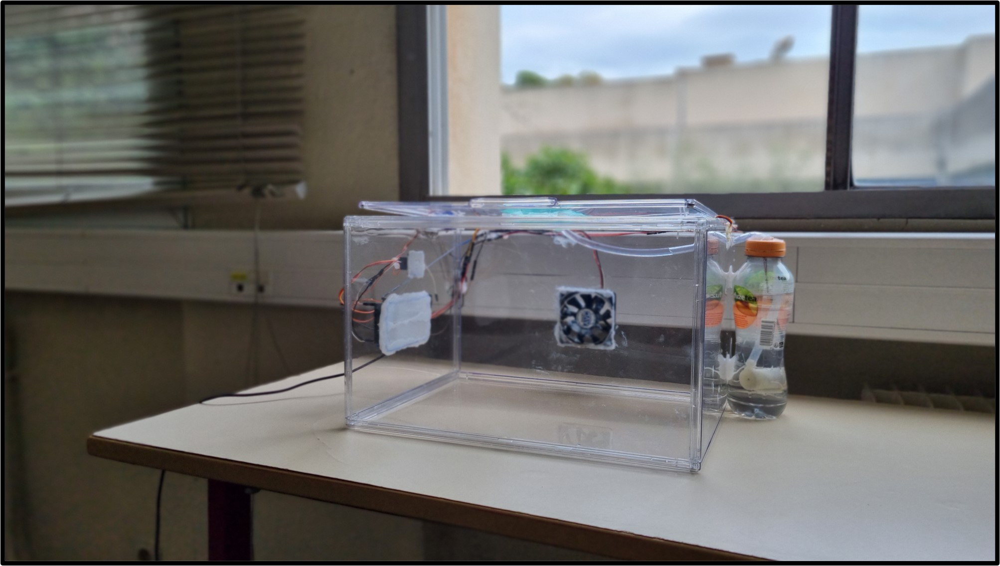
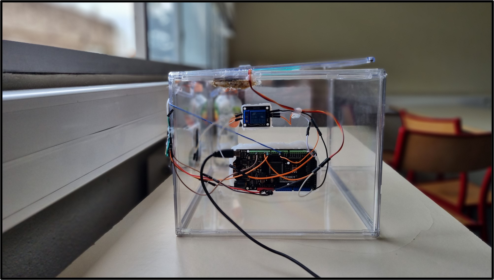

Cette partie sert à faire fonctionner les actionneurs de notre Serre Connecté. Elle contient un fichier ino pour l'application Arduino.

Face avant de la serre

Le côté de la serre

Explication du fonctionnement de la maquette :

Ventialation : 
--> Deux servomoteurs situés sur chaque côtés de la maquette qui lève la partie surpérieure de la serre.
--> Le ventilateur situé à l'arrière de la serre qui démarre son activité. Le sens de courant est vers l'extérieur de la maquette.
--> La durée est déterminé par la variable temps_ventilation.

Arrosage :
--> La pompe a eau situé dans un réservoir d'eau qui s'active.
--> La durée est détermine par la variable temps_pompe.

Démosntration :
